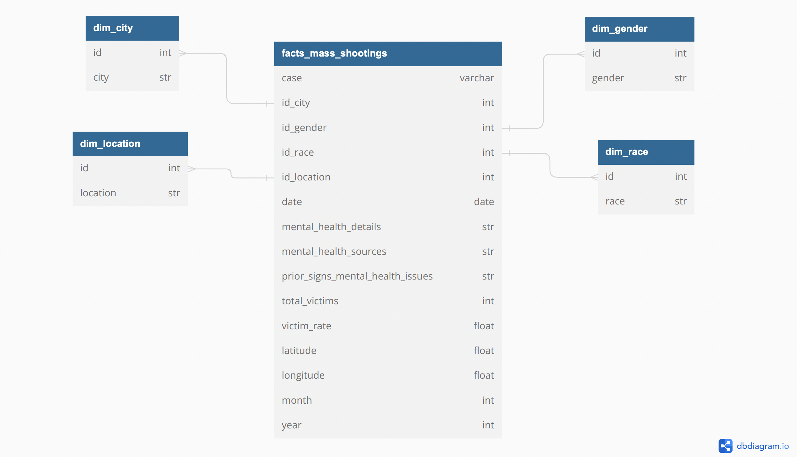

<p align="left"></p>

# Project M2 
# Business Intelligence with Tableau


## Overview

This repository contains an interactive dashboard developed in Tableau that displays information about mass shootings in the United States. The dashboard is based on an updated dataset and provides a clear and concise visualization of information related to these tragic events.

The purpose of this project is to to apply our knowledge gained from module 2 of this program. In this project, our main task was selecting a dataset, utilizing Tableau or Power BI to explore it, and creating a Story/Dashboard that presents the insights you have extracted from the data. It is important to showcase your proficiency and the concepts learned throughout the chapter.

---

## Repository Structure

The repository is organized as follows:

```/data:``` This folder contains the data files used in the dashboard. It includes a CSV file with detailed information about mass shootings in the United States and the final csv file that was used to create the data model.

```/images:``` Here you will find the images used in the README and in the dashboard itself.

```/notebooks:``` Jupyter file used to clean and filter data.

```/dashboard.txt:``` This is the text file including the Tableau Public link. You can open it and explore the visualization using Tableau Desktop or Tableau Public.

```/datamodel:``` showing the table schemas and relations between them.

```/functional design mockup:``` representing the dashboard parts and functionalities.
```/README.md:``` file explaining the job done.




## Steps followed

I have used a dataset that includes information about shootings in the United States in order to carry out this project. Within this dataset, you can find data such as race, year, mental health issues, location, etc. After selecting and cleaning the data, I have decided to ask myself the following questions as a guide to base my dashboard on:

- Which racial group has conducted the most shootings in the USA?
- Total number of cases and individuals affected
- Number of victims and the year of the shooting
- Did the perpetrators have mental health issues?
- Where were these firearms obtained?
- What types of firearms were used?
- Were these firearms obtained legally?


## Dashboard features 

The Tableau dashboard on mass shootings in the United States offers various functionalities that allow you to visualize and better understand the information. Some of the main features include:

- Geographic Visualization: The interactive map shows the locations of mass shootings in the United States, allowing you to identify geographic patterns and areas of higher incidence.


- Statistics and Summary: A panel with key statistics is provided, such as the total number of mass shootings, the number of victims, and relevant demographic information. This helps to get a quick overview of the data.

- Information about weapons and mental health issues.

## Contributions 

Contributions are welcome! If you want to improve the dashboard or add new features, you can do so through a pull request. Be sure to describe your changes and provide clear explanations.
